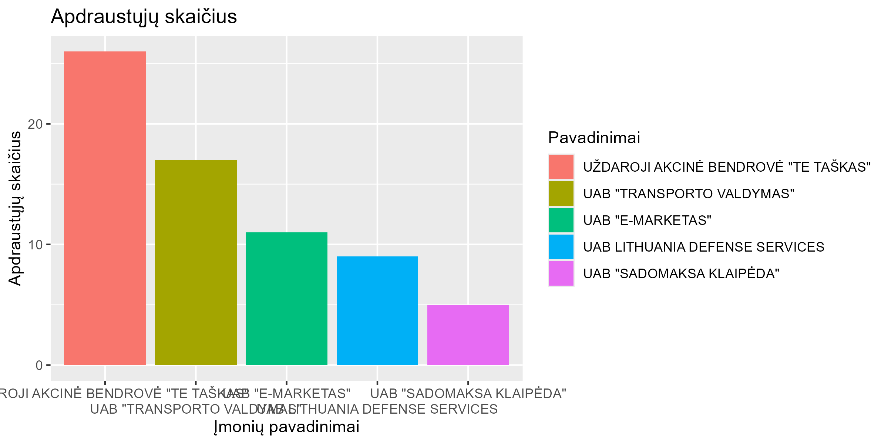

# R Laboratorinis darbas: duomenų vizualizacija

|Variantas | ecoActCode|Formatas          |
|:---------|----------:|:-----------------|
|5           |          452000|https://atvira.sodra.lt/imones/downloads/2023/monthly-2023.json.zip|

### 2.1 Užduotis

Atsakymas:

Išvados: Didžioji dalis darbuotojų vidutiniškai uždirba 1000-1200 Eur.

### 2.2 Užduotis

Atsakymas:

Išvados: UAB LITHUANIA DEFENSE SERVICES darbo užmokestis ženkliai didesnis už likusias bendroves.

### 2.3 Užduotis

Atsakymas:

Išvados: UAB "TE TAŠKAS" turi daugiausia apdraustų daurbuotojų.

### 3. Užduotis

Shiny R aplikacijos nuotrauka:

